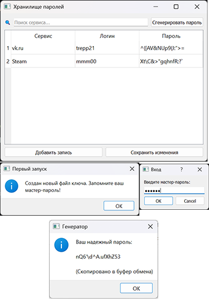

# Хранилище паролей
Проект для лабораторной работы №3 - Разработка ПО по варианту 12.

## Описание
Данное приложение предназначено для управления учетными данными. В отличие от обычных текстовых менеджеров, здесь реализовано полное шифрование базы данных «на лету», что делает доступ к паролям невозможным без знания мастер-пароля.

## Ключевые функции
- Master Password Protection: Доступ к хранилищу защищен главным паролем.
- Strong Encryption: Использование алгоритма AES-256 (Fernet) для защиты данных.
- Криптостойкий генератор: Создание случайных паролей через модуль secrets.
- Clipboard Integration: Автоматическое копирование паролей в буфер обмена для удобства.
- Live Search: Мгновенная фильтрация записей по названию сервиса или логину.
- Безопасное хранение ключей: Использование функции PBKDF2 для формирования ключа из пароля и соли.

## Технологический стек
- Язык: Python 3.10+
- GUI Фреймворк: PyQt5
- Библиотека шифрования: cryptography
- Контроль версий: Git (Feature Branch Workflow)

## Архитектура проекта
Приложение построено по модульному принципу для обеспечения Separation of Concerns (разделения ответственности):

- *src/crypto.py* — Криптографическое ядро (хеширование, шифрование).
- *src/vault.py* — Логика управления базой данных (CRUD) и сериализация в JSON.
- *src/generator.py* — Модуль генерации безопасных паролей.
- *src/main_gui.py* — Точка входа и графическая оболочка на PyQt5.

## Установка и запуск
1. Клонирование репозитория
```Bash
git clone https://github.com/sdfg13/PasswordManager.git
cd PasswordManager
```
2. Установка зависимостей
```Bash
pip install -r requirements.txt
```
3. Запуск приложения
```Bash
python src/main.py
```
## Безопасность и Git
Файлы с данными (соль и зашифрованный сейф) хранятся в директории src/data/.

**Важно**: Папка data/ добавлена в .gitignore, чтобы ваши личные зашифрованные пароли никогда не попали в публичный доступ. Для работы программы на новом устройстве она автоматически создаст новую «соль» при первом запуске.

## Скриншоты приложения
